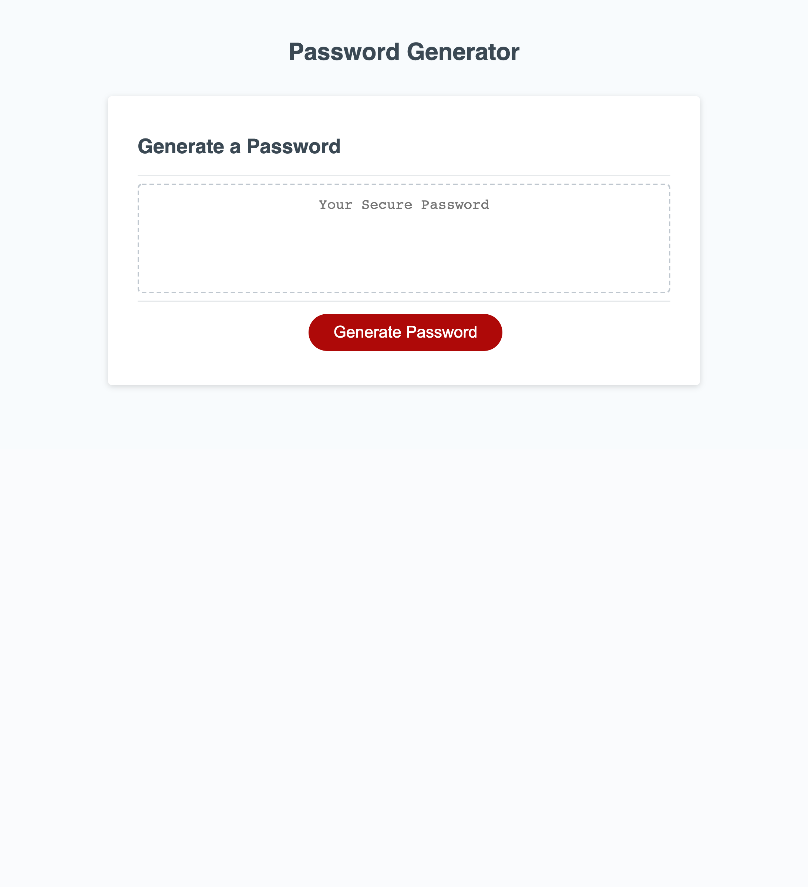

# VGUTIERREZ_Password_Generator

Week 3 homework assignment- Password generator

## Summary

This is a fully functioning password generator. It can produce passwords that include uppercase letters, lower case letters, numbers and special characters that can be anywhere from 8-128 characters long.

Push the "Generate Passwoord," button to try it out!

## Technologies Used

[Github](https://github.com/vinetteg/Javascript_Fundamentals_Quiz)  

## Mockup

## Link To Application

[Deployed Web Page](https://vinetteg.github.io/Javascript_Fundamentals_Quiz/)  
[Repo](https://github.com/vinetteg/Javascript_Fundamentals_Quiz)
